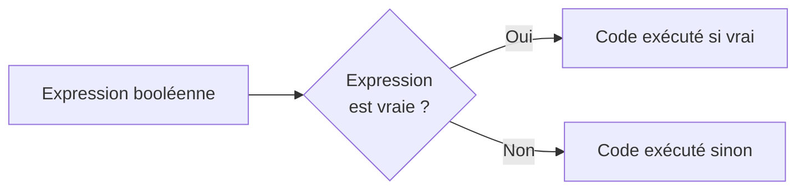
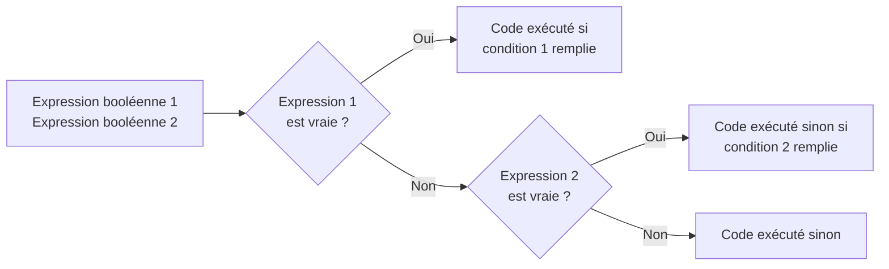
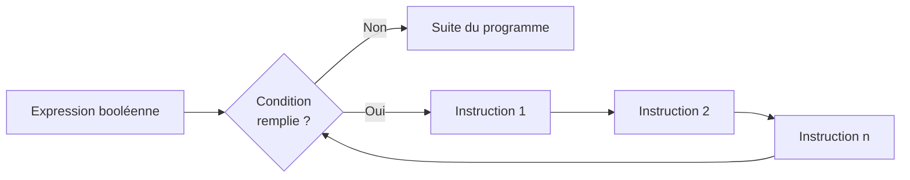
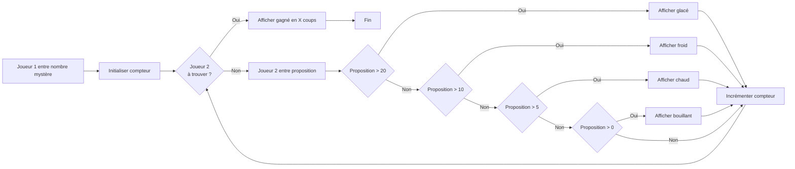

# Python 3 Formation 0


# 1 - Introduction
## Histoire et pourquoi Python
### Historique
Python est un langage de programmation orientée objet interprété, il a été développé dans les années 1990 par Guido Von Rossum qui est fan de la série Monty Python.
Depuis 2001 Python est détenu par la Python Software Foundation, une association à but non lucratif.
En 2008 la Python Software Foundation publie Python 3 qui casse la compatibilité ascendante des versions. Le but est de réparer certains défauts du langage et de supprimer les éléments obsolètes.
La mort de Python 2 est depuis annoncée, la Python Software Foundation arrêtera le support de Python 2 le 1 Janvier 2020
https://pythonclock.org/
### Pourquoi Python
Python est un langage lisible et épuré, il nous permet d’aller droit au but en écrivant peu.
Le langage existe depuis 27 ans, il y a une forte communauté en cas de besoin.
Il y a une quantité impressionnante de bibliothèques pour nous aider, il est rare de devoir coder un système complet.
## Installation
 Les prérequis pour la suite de la formation sont :
 
 - Python 3 (>= 3.4)
 - Virtualenv
 - Un éditeur de texte
### Python 3
#### Linux
Si vous êtes sous Linux, il y a de grandes chances que Python 3 soit déjà installé, pour le vérifier il suffit de taper les commandes suivantes :
```
# Test de la version de Python par défaut
python
Python 2.7.12 (default, Dec  4 2017, 14:50:18)
[GCC 5.4.0 20160609] on linux2
Type "help", "copyright", "credits" or "license" for more information.
>>>
```
```
# Test de la version de Python 3
python3
Python 3.5.2 (default, Nov 23 2017, 16:37:01)
[GCC 5.4.0 20160609] on linux
Type "help", "copyright", "credits" or "license" for more information.
>>>
```
Si Python 3 n'est pas installé, il vous suffit de taper la commande suivante :
```
apt-get install python3 python3-pip python3-dev
```
#### Windows 
Sous Windows il suffit de télécharger et installer l'exécutable Python
Au choix
Exécutable Python 3.6.5 : https://www.python.org/ftp/python/3.6.5/python-3.6.5-amd64.exe
Installateur Web Python 3.6.5 : https://www.python.org/ftp/python/3.6.5/python-3.6.5-amd64-webinstall.exe
### Virtualenv
Python nous permet d'installer des bibliothèques qui seront disponibles pour l'ensemble des programmes / scripts que nous allons créer.
Nous pouvons donc créer un environnement d’exécution pour nos programmes / scripts ce qui est très pratique.
Arrive vite un problème, la gestion des dépendances et des versions de paquets. 
Comment être sûr que l'installation d'une bibliothèque n'affecte pas une application en production à cause d'une dépendance ?
Réponse : La séparation des environnements, virtualenv nous permet de créer des environnements python virtuel, ainsi chaque programme (mais aussi des systèmes entiers) possède son propre environnement.
#### Linux
```
# Installation virtualenv (Ubuntu 16.04)
apt-get install python3-virtualenv virtualenv
```

Création d'un environnement virtuel :
```
virtualenv <nom_env>
# Exemple
virtualenv env
```
Utilisation de l'environnement virtuel :
```
source <nom_env>/bin/activate
# Exemple
source env/bin/activate
```
Le terminal indique que nous sommes dans un environnement virtuel en précédant notre nom d'utilisateur par (<nom_env>)
```
averdier:~$ source env/bin/activate
(env) averdier:~$
```
Pour quitter l'environnement, il suffit de taper
```
deactivate
```
#### Windows et Mac
Sur Windows et Mac je conseille l'utilisation de PyCharm, un IDE qui nous permet de le faire automatiquement.
> Sous Windows on peut utiliser WSL, mais celui-ci ne sera pas connecté à notre IDE
### Éditeur de texte
En soi n'importe quel éditeur de texte fera l'affaire pour Python, personnellement je conseille l'utilisation d'un IDE (Environnement intégré de développement) qui nous simplifie la vie par bien des points :
- Autocomplétion
- Détection des erreurs avant exécution
- Configurations d’exécution
- Création d'environnements virtuels
- Etc
#### PyCharm Community
Je conseille l'utilisation de PyCharm, c'est l'ide le plus complet que j'ai trouvé, il possède un thème sombre et c'est celui que j'utilise.
https://www.jetbrains.com/pycharm/
> Un IDE est un outil complet qui consomme de la ressource

# 2 - L'Interpréteur
Python est un langage interprété, c'est-à-dire qu'un interpréteur est en charge de lire ligne par ligne notre code pour générer les données de sortie.
> L'interpréteur est lié à l'environnement, il a accès à toutes les bibliothèques présentes dans l'environnement
Pour lancer l'interpréteur, il suffit de:
#### Linux
Taper la commande
```
python3
``` 
#### Windows
Chercher Python 3 dans le menu démarrer et le lancer
## Un outil au quotidien 
Une fois Python 3 lancé, vous devriez avoir la fenêtre suivante 
```
Python 3.5.2 (default, Nov 23 2017, 16:37:01)
[GCC 5.4.0 20160609] on linux
Type "help", "copyright", "credits" or "license" for more information.
>>>
```
Le **>>>** indique que l'interpréteur attend une commande de notre part, à partir de là nous pouvons tester des algorithmes, faire des calculs, faire des essais de script.
Exemple:
```
Python 3.5.2 (default, Nov 23 2017, 16:37:01)
[GCC 5.4.0 20160609] on linux
Type "help", "copyright", "credits" or "license" for more information.
>>> a = 5
>>> b = 7
>>> c = 3
>>> (a * c) / (c + b)
1.5
>>> exit()
```
Il est fréquent d'avoir un interpréteur Python d'ouvert quand on développe.
La plupart des exemples fournis durant la formation ont été faits à l'aide de l'interpréteur, je vous invite à essayer l'ensemble des commandes fournies dans la formation.
## Indentation
La notion de bloc d'instruction est importante dans l'interpréteur, un espace suffit pour faire une indentation.
Exemple :
```
>>> kebab = 10
>>> if kebab > 5:
...  print("Un kebab de luxe")
...
Un kebab de luxe
>>>
```
> Faire attention à l'espace entre `...` et `print`
Les `...` indiquent que nous sommes dans un bloc et qu'il faut faire attention à l'indentation
# 3 - Variables
L'essentiel du travail dans le développement est la manipulation de données sous diverses formes, simples ou complexes.
On peut représenter la mémoire de l'ordinateur comme un tableau contenant l'ensemble de nos données, chaque case de notre tableau possède un nom qui nous permet de lire la valeur de la case.
Une variable est composée d'un nom et d'une valeur déterminée.
Les noms de variables sont des noms que vous choisissez vous-même, il est important de donner un sens au nom de vos variables.
Exemple dans le cas d'une caisse enregistreuse:
```
Python 3.5.2 (default, Nov 23 2017, 16:37:01)
[GCC 5.4.0 20160609] on linux
Type "help", "copyright", "credits" or "license" for more information.
>>> kebab = 5
>>> coca = 2.5
>>> glace = 4
>>> total = kebab + coca + glace
>>> total
11.5
>>> exit()
```
A plus de sens et est plus lisible que :
```
Python 3.5.2 (default, Nov 23 2017, 16:37:01)
[GCC 5.4.0 20160609] on linux
Type "help", "copyright", "credits" or "license" for more information.
>>> a = 5
>>> b = 2.5
>>> c = 4
>>> d = a + b + c
>>> d
11.5
>>> exit()
```
## Règles de nommage
Sous Python, les noms de variables doivent en outre obéir à quelques règles simples:
Un nom de variable est une séquence de lettres (a→z , A→Z) et de chiffres (0→9), qui doit toujours commencer par une lettre.
Seules les lettres ordinaires sont autorisées. Les lettres accentuées, les cédilles, les espaces, les caractères spéciaux tels que $, #, @, etc. sont interdits, à l’exception du caractère _ (souligné).
La casse est significative (les caractères majuscules et minuscules sont distingués).
#### Mots clés du langage
33 noms de variable sont interdits, car ils sont utilisés par le langage lui-même.
> and, as, assert, break, class, continue, def, del, elif, else, except, False, finally, for, from, global, if, import, in, is, lambda, None, nonlocal, not, or, pass, raise, return, True, try, while, with, yield
## Affectation 
L'affectation est une opération qui nous permet de lier un nom de variable et une valeur, dans Python comme dans beaucoup de langage, l'opérateur d'affection est **=**
Exemple
```
>>> <nom_variable> = <valeur>
>>> kebab = 5 # On assigne la valeur 5 à la variable kebab
>>> kebab = 7 # On change la valeur de la variable kebab
```
### Affectation multiple
Il est possible d'affecter plusieurs variables à la fois, cette technique est souvent utilisée lors d'initialisation ou de pour récupérer les valeurs d'un tuple (voir le chapitre sur les tuples).
Exemple
```
# Affecter la même valeur à plusieurs variables
>>> <nom_variable_1> = <nom_variable_2> = <valeur>
>>> vitesse = acceleration = 0
# Affecter plusieurs variables à la fois
>>> <nom_variable_1>, <nom_variable_2> = <valeur_1>, <valeur_2>
>>> poids, gravite = 30, 9.81
```
### Afficher la valeur d'une variable
```
# Dans l'interpréteur
>>> kebab = 5
>>> kebab
5
# Dans notre code
>>> print(kebab)
5
```
## Types de variables
Python possède un typage dynamique, c'est-à-dire qu'il détermine le type de notre variable au moment de l'affectation.
Python possède 5 types standards:
 - Nombres
 - Chaine de caractères
 - Listes
 - Tuples
 - Dictionnaires
 - Booléens
Pour connaitre le type d'une variable, il suffit de faire:
```
>>> kebab = 5
>>> type(kebab)
<class 'int'>
```
### Nombres
Le type nombre est divisé en 3 types
 - int :  Entier 
 - float : Nombre à virgule
 - complex : Nombre complexe
Exemple : 
```
>>> myInt = 3
>>> myFloat = 121.1
>>> myComplex = 3.14j
>>> type(myInt)
<class 'int'>
>>> type(myFloat)
<class 'float'>
>>> type(myComplex)
<class 'complex'>
```
### Chaines de caractères
Le type string nous permet de stocker des messages.
Exemple :
```
<nom_variable> = "<valeur>"
>>> message = "Hello Wolrd"
>>> message
'Hello Wolrd'
>>> print(message)
Hello Wolrd
>>>
```
Nous pouvons aussi faire de la concaténation de chaines à l'aide de l'opérateur **+**
Exemple:
```
>>> part_1 = "Hello"
>>> part_2 = "World"
>>> part_1 + part_2
'HelloWorld'
>>> part_1 + " " + part_2
'Hello World'
>>> message = part_1 + " " + part_2
>>> message
'Hello World'
```
### Listes
Les listes sont des tableaux dynamiques qui nous permettent de stocker tout ce que l'on veut, quel que soit le type.
Exemple : 
```
# Déclarer une liste
<nom_variable> = [<valeur_1>, <valeur_2>, etc...]
>>> maListe = []
>>> maListe = [1, 2, 3, 4, 5]
>>> maListe
[1, 2, 3, 4, 5]
>>> maListe = [1, "Bonjour", 3.14, [1, 3]]
>>> maListe
[1, 'Bonjour', 3.14, [1, 3]]
# Connaitre la taille d'une liste
len(<nom_variable>)
>>> len(maListe)
4
# Accéder à un élément de la liste
<nom_variable>[indice]
>>> maListe[1]
'Bonjour'
# Modifier un élément de la liste
<nom_variable>[indice] = <valeur>
>>> maListe[1] = "Hello World"
>>>> maListe[1]
'Hello World'
```

> Les listes font l'objet d'un chapitre
### Tuples
Les tuples sont semblables aux listes à ceci près qu'ils ne sont pas modifiables, ils sont préférables aux listes quand on veut être certain que certaines données ne soient pas modifiables.
Exemple:
```
# Déclarer un tuple
<nom_varibale> = (<valeur_1>, <valeur_2>)
>>> mongoConfig = ('localhost', 27017)
>>> mongoConfig
('localhost', 27017)
# Accéder à un élément du tuple
<nom_variable>[indice]
>>> mongoConfig[0]
'localhost'
# Affecter le contenu d'un tuple à des variables
>>> host, port = mongoConfig
>>> host
'localhost'
>>> port
27017
```
> Voir chapitre sur les listes pour accéder à une information précise
### Dictionnaires
Les dictionnaires sont un type de données extrêmement puissant qui permet d'associer une clé à une valeur.
Exemple:
```
# Déclarer un dictionnaire
<nom_variable> = {<cle_1>: <valeur_1>, <cle_2>: <valeur_2>}
>>> mongoConfig = {"host": "localhost", "port": 27017}
>>> mongoConfig
{'port': 27017, 'host': 'localhost'}
# Accéder à un élément du dictionnaire
<nom_variable>[cle]
>>> mongoConfig["host"]
'localhost'
# Modifier un élément du dictionnaire
<nom_variable>[cle] = <valeur>
>>> monConfig["port"] = 27018
>>> mongoConfig["port"]
27018
``` 
>  Les dictionnaires font l'objet d'un chapitre
### Booléen
Les booléens sont des variables qui possèdent uniquement 2 états, Vrai ou Faux.
Exemple:
```
>>> eauBrule = False
>>> pythonEstBien = True
```
# 4 - Opérateurs
Maintenant que nous savons comment déclarer des variables, il est temps de voir les différents opérateurs de Python.
## Opérateurs arithmétiques
Les opérateurs arithmétiques nous permettent de faire des calculs sur nos variables, les opérateurs disponibles dépendent du type de variable, il est logique de pouvoir diviser 2 nombres, moins de diviser une chaine de caractères par un nombre.
> Le type de sortie dépend des types fournis en entrée
### Opérateur +
Permets d'ajouter 2 valeurs entre elles.
```
<resultat> = <valeur_1> + <valeur_2>
>>> kebab = 5
>>> coca = 2.5
>>> glace = 3
>>> total = kebab + coca + glace
```
### Opérateur +=
Permets d'incrémenter la valeur d'une variable.
```
<nom_variable> += <valeur>
>>> compteur = 0
>>> compteur += 1
>>> compteur
1
```
### Opérateur -
Permets de soustraire 2 valeurs entre elles.
```
<resultat> = <valeur_1> - <valeur_2>
>>> pointVie = 100
>>> degats = 30
>>> reste = pointVie - degats
>>> reste
70
```
### Opérateur -=
Permets de décrémenter la valeur d'une variable.
```
<nom_variable> -= <valeur>
>>> pointVie = 100
>>> degats = 30
>>> pointVie -= degats
>>> pointVie
70
```
### Opérateur /
Permets de réaliser une division entre 2 valeurs.
```
<resultat> = <valeur_1> / <valeur_2>
>>> totalMl = 230
>>> personnes = 7
>>> mlParPersonne = totalMl / personnes
>>> mlParPersonne
32.857142857142854
```
### Opérateur //
Permets de réaliser une division entière de 2 valeurs.
```
<resultat> = <valeur_1> // <valeur_2>
>>> totalMl = 230
>>> personnes = 7
>>> totalMl / personnes
32.857142857142854
>>> totalMl // personnes
32
>>> resultat = totalMl // personnes
>>> resultat
32
```
### Opérateur %
Permets de récupérer le reste de la division entière de 2 valeurs.
```
<resultat> = <valeur_1> % <valeur_2>
>>> totalMl = 230
>>> personnes = 7
>>> totalMl // personnes
32    # 230 contient 32 * 7
>>> totalMl % personnes
6     # 230 - (32 * 7) = 6
>>> (totalMl // personnes) * personnes + 6
230   # 32 * 7 + 6 = 230
>>> resultat = totalMl % personnes
>>> resultat
6
```
### Opérateur * 
Permets de multiplier 2 valeurs entre elles.
```
<resultat> = <valeur_1> * <valeur_2>
>>> ue = 2
>>> coeff = 4
>>> resultat = ue * coeff
>>> resultat
8
```
## Opérateurs de comparaison
Les opérateurs de comparaison nous permettent de comparer les valeurs de nos variables, les opérateurs disponibles dépendent du type de variable.
> Le type de sortie est un booléen
### Opérateur >
Permets de vérifier si une valeur est supérieure à une autre.
```
<resultat> = <valeur_1> > <valeur_2>
>>> vie = 100
>>> mana = 500
>>> vie > mana
False
>>> vie > 100
False
>>> mana > vie
True
>>> resultat = mana > vie
>>> resultat
True
```
### Opérateur >=
Permets de vérifier si une valeur est supérieure ou égale à une autre.
```
<resulat> = <valeur_1> >= <valeur_2>
>>> vie = 100
>>> limite = 100
>>> vie > limite
False
>>> vie >= limite
True
>>> resultat = vie >= limite
>>> resultat
True
```
### Opérateur <
Permets de vérifier si une valeur est inférieure à une autre.
```
<resultat> = <valeur_1> < <valeur_2>
>>> vie = 100
>>> degat = 30
>>> vie < degat
False
>>> degat < vie
True
>>> vivant = degat < vie
>>> vivant
True
```
### Opérateur <=
Permets de vérifier si une valeur est inférieure ou égale à une autre.
```
<resultat> = <valeur_1> <= <valeur_2>
>>> temperature = 0
>>> temperatureGel = 0
>>> temperature <= temperatureGel
True
>>> temperature <= -1
False
>>> gel = temperature <= temperatureGel
```
### Opérateur ==
Permets de vérifier l'égalité entre 2 variables.
```
<resultat> = <valeur_1> == <valeur_2>
>>> limite = 100
>>> rage = 100
>>> limite == rage
True
>>> limite == 200
False
>>> berserk = limite == rage
```
### Opérateur !=
Permets de vérifier la non égalité entre 2 variables.
```
<resultat> = <valeur_1> != <valeur_2>
>>> attendu = 100
>>> fournis = 50
>>> attendu != fournis
True
>>> attendu != 100
False
>>> probleme = fournis != attendu
```
 
## Opérateurs booléens
 Les opérateurs booléens nous permettent de faire de l'algèbre de bool à l'aide des booléens.
 > Le type de sortie est un booléen
 
### Opérateur not
Il s'agit de l'opérateur de négation, ce qui est vrai devient faux et inversement.
Table de vérité :
|variable|not variable|
|--|--|
| False | True |
| True | False |
```
<resultat> = not <variable>
>>> chaud = True
>>> not chaud
False
>>> froid = not chaud
>>> froid
False
```
### Opérateur and
Il s'agit de l'opérateur et, le résultat est vrai si et seulement si les 2 valeurs sont vraies.
Table de vérité:
|variable_1| variable_2 | variable_1 and variable_2 |
|--|--|--|
| False | False | False |
| True | False | False |
| True | True | True |
```
<resultat> = <valeur_1> and <valeur_2>
>>> soleil = True
>>> mer = True
>>> soleil and mer
True
>>> soleil and False
False
>>> vacances = soleil and mer
>>> vacances
True
```
### Opérateur or
Il s'agit de l'opérateur ou, le résultat est vrai si l'une des 2 valeurs est vraie.
Table de vérité:
|variable_1| variable_2 | variable_1 or variable_2 |
|--|--|--|
| False | False | False |
| True | False | True |
| True | True | True |
```
<resultat> = <valeur_1> or <valeur_2>
>>> soleil = False
>>> mer = True
>>> soleil or mer
True
>>> soleil or True
True
>>> vacances = soleil or mer
>>> vacances
True
```
## Priorité des opérations
Il faut faire attention aux priorités entre les opérateurs, par exemple comme en mathématique le `*` et prioritaire sur le `+`
Exemple :
```
>>> 1 + 3 * 2
7
```
Comme en mathématique il est possible de spécifier la priorité des opérations à l'aide de parenthèse :
```
>>> (1 + 3) * 2
8
```
# 5 - Notre premier programme
Jouer avec l'interpréteur c'est bien, mais maintenant il est temps de créer notre premier programme avec l'éternel Hello World et de le sauvegarder dans un fichier .py

## Objectif
Demander son prénom à l'utilisateur et lui dire bonjour.

### Lecture d'une entrée clavier
Pour lire une entrée clavier dans un terminal il nous suffit d'utiliser la fonction **input**
```
<resultat> = input('<message>')
```
### Afficher un résultat
Pour afficher un résultat dans un terminal, il nous suffit d'utiliser la fonction **print**
```
maVariable = 'mon message'
print(maVariable)
```
### Concaténation de string
Pour faire une concaténation entre 2 string, il nous suffit d'utiliser l'opérateur **+**
```
prefix = 'Bonjour'
separateur = ' '
nom = 'Joe'
message = prefix + separateur + nom
```
## Création du projet
 1. Ouvrir PyCharm
 2. Créer un nouveau projet
 3. Choisir Pure Python
 4. Vérifier qu'un environnement virtuel **Python 3** sera bien créé
 5. Créer un fichier hello.py
## Code
Notre programme est très simple, on demande son prénom et on lui dit bonjour.
```
# hello.py
prefix = "Bonjour"  
separator = " "  
prenom = input("Entrez votre prénom : ")  
print(prefix + separator + prenom)
```
## Exécution
### PyCharm
Clique droit dans le fichier puis " run 'hello' "
### Console
```
python3 hello
```
## Résultat
```
Entrez votre prénom : Joe
Bonjour Joe
```

# 6 - Structures conditionnelles
Les structures conditionnelles nous permettent d’exécuter des blocs d'instructions en fonction d'expressions booléennes.
En Python les blocs d'instructions sont délimités par des indentations ce qui permet de facilement les distinguer.
## Portée des variables
La portée des variables est descendante, un bloc enfant à accès aux variables du bloc parent, par contre un bloc parent n'a pas connaissance des variables de ses enfants.
Exemple qui fonctionne:
```
# Bloc parent
resultat = 0
eu = 2
if eu > 0:
  # Bloc enfant
  resultat = 20 * eu
  # Fin bloc enfant
# Reprise bloc parent
print(resultat)
# Fin bloc parent
```
Exemple qui ne fonctionne pas
```
# Bloc parent
eu = 2
if eu > 0:
  # Bloc enfant
  resultat = 20 * eu
  # Fin bloc enfant
# Reprise bloc parent  
print(resultat) --> resultat n'existe pas dans le bloc parent
# Fin bloc parent
``` 

## Si : if
Permets l'exécution d'un bloc d'instruction si une expression booléenne est vraie.
Schéma logique:
 ```mermaid
graph LR
A[Expression booléenne]
B{Expression <br>est vraie ?}
C[Code exécuté]
D[Code ignoré]
A --> B
B -- Oui --> C
B -- Non --> D
```
```
if <expression_bool>:
  # Votre code
pointVie = 100
if pointVie > 0:
  print("Personnage vivant")
```
## Sinon : else
Permets l'exécution d'un bloc d'instructions si une **condition** n'est pas remplie.
Schéma logique:

```
if <expression_bool>:
  # Votre code
else:
  # Votre code
pointVie = 100
if pointVie > 0:
  print("Personnage vivant")
else:
  print("Personnage mort")
```
## Sinon si : elif
Permets d'exécuter une condition si la première condition n'est pas remplie.
Schéma logique:

```
if <expression_bool>:
  # Votre code
elif:
  # Votre code
else:
  # Votre code
  
berserkLimite = 200
pointVie = 200
if pointVie == berserkLimite:
  print("Personnage en mode berserk, fuyez")
elif pointVie > 0:
  print("Personnage vivant")
else:
  print("Personnage mort")
```
# 7 - Boucles
En programmation, on appelle boucle un système d'instructions qui permet de répéter un certain nombre de fois, voire indéfiniment, toute une série d'instructions.
Python propose 2 instructions pour réaliser des boucles, **while** et **for in**
## While
La boucle while est la plus simple, elle répète un bloc d'instructions tant que sa condition est remplie.
Schéma logique:

```
while <expression_bool>:
  # Votre code
compteur = 0
while compteur < 5:
  print(compteur)
  compteur += 1
# Sortie
0
1
2
3
4
```
> La boucle for in sera abordée pendant les chapitres Liste et dictionnaire
## Important
Il faut faire très attention à ce que la variable présente dans la condition **change** au cours de la boucle, si ce n'est pas le cas, la condition sera toujours remplie, et il y aura une jolie boucle infinie qui bloquera votre programme.

## Exercice : chaud, froid, glacé, bouillant
Afin de mettre en pratique les conditions et les boucles de manière ludique nous allons faire un petit jeu 2 joueur, le but du jeu est de trouver le nombre de notre adversaire en un minimum de coups.
### Déroulement
 - Le joueur 1 entre un nombre compris entre 0 et 100
 - Le programme demande le nombre mystère au joueur 2 tant que celui-ci n'a pas entré la bonne valeur.
On appelle **diff** la valeur absolue de la différence entre le nombre mystère et la proposition du joueur 2
- Si diff est supérieur à 20, le programme affichera **glacé**
- Si diff est supérieur à 10 et inférieur à 20, le programme affichera **froid**
- Si diff est supérieur à 5 et inférieur à 10, le programme affichera **chaud**
- Si diff est inférieur à 5 et supérieur à 0, le programme affichera **bouillant**
- Si diff est égal à zéro c'est que nous avons trouvé le nombre mystère, le programme affichera **Gagné en X coups** et s’arrêtera.
### Cadre
Pour simplifier notre code, on partira du principe que les utilisateurs entreront uniquement des nombres entiers, nous verrons plus tard comment traiter les cas ou l'utilisateur ne fait pas ce que l'on attend de lui.
### Cast
La fonction **input** de Python nous retourne un résultat sous forme de string, il est possible de forcer le type d'une variable (cast)
```
# Cast d'un string en int
valeur = input("Entrez un entier : ")
valeur = int(valeur)
```

### Schéma logique:

### Code
Proposition de solution
```
# chaud_froid.py  
  
mystere = input("Entrez le nombre mystère : ")  
mystere = int(mystere)  
  
if mystere < 0 or mystere > 100:  
  print("Le nombre doit être compris entre 0 et 100")  
  quit(-1)  # On force le programme à quitter en indiquant une erreur, -1 est souvent associé à une erreur quand 0 est associé à "tout va bien"  
  
compteur = 0  
proposition = -1 # On fixe délibérément une proposition qui ne peut pas fonctionner  
while proposition != mystere:  
    proposition = int(input("Entrez un nombre : "))  
  
    diff = abs(mystere - proposition)  
  
    if diff > 20:  
        print("Glacé")  
    elif diff > 10:  
        print("Froid")  
    elif diff > 5:  
        print("Chaud")  
    elif diff > 0:  
        print("Bouillant")  
    else:  
        print("Trouvé")  
  
    compteur += 1  
  
print("Gagné en " + str(compteur) + " coups")
```
# 8 - Listes
## Rappel
Les listes sont des tableaux dynamiques qui nous permettent de stocker tout ce que l'on veut, quel que soit le type.
Exemple : 
```
# Déclarer une liste
<nom_variable> = [<valeur_1>, <valeur_2>, etc...]
>>> maListe = []
>>> maListe = [1, 2, 3, 4, 5]
>>> maListe
[1, 2, 3, 4, 5]
>>> maListe = [1, "Bonjour", 3.14, [1, 3]]
>>> maListe
[1, 'Bonjour', 3.14, [1, 3]]
```
## Attention aux indices
Une liste commence toujours par 0, c'est perturbant au début, mais on s'y fait.
Ce qui veut dire que pour une liste de **4** éléments, les indices vont de **0 à 3**.

## Opérations sur les listes
### Taille d'une liste
Connaitre la taille d'une liste est l'une des opérations les plus importantes, cela nous permet de parcourir et d’accéder à des éléments de la liste sans erreur.
Connaitre la taille d'une liste est possible via la fonction **len**
Exemple:
```
len(<liste>)
>>> notes = [16, 18, 14, 17]
>>> len(notes)
4
```
### Accéder à un élément
Pour accéder à un élément, il suffit de fournir l'indice de l'élément.
Exemple:
```
<liste>[<indice>]
>>> notes = [16, 18, 14, 17]
>>> notes[0]
16
>>> notes[1]
18
>>> notes[2]
14
>>> notes[3]
17
>>> notes[4]
Traceback (most recent call last):
  File "<stdin>", line 1, in <module>
IndexError: list index out of range
>>>
```
### Modifier un élément d'une liste
Pour modifier un élément dans une liste, il faut fournir l'indice et la nouvelle valeur.
Exemple:
```
>>> personnages = ["Guenièvre", "Karadoc", "Merlin", "Lancelot", "Perceval"]
>>> personnages[3]
'Lancelot'
>>> personnages[3] = "Arthur"
>>> personnages[3]
'Arthur'
>>>
```
### Ajouter un élément à la fin d'une liste
Pour ajouter un élément à une liste il suffit d'utiliser la méthode **append**.
Exemple:
```
<liste>.append(<value>)
>>> notes = [16, 18, 14, 17]
>>> notes.append(15)
>>> notes
[16, 18, 14, 17, 15]
>>>
```
### Ajouter un élément à une position définie
Il est possible d'ajouter un élément à une position définie à l'aide de la méthode **insert**, les éléments du tableau subiront un décalage vers la droite.
Exemple:
```
<liste>.insert(<indice>, <value>)
>>> notes = [16, 18, 14, 17]
>>> notes.insert(0, 10)    # Ajout de la valeur 10 à la position 0
>>> notes
[10, 16, 18, 14, 17]
```
### Connaitre l'indice d'un élément dans une liste
Il est possible de connaitre l'indice d'un élément dans une liste à l'aide de la méthode **index**.
Exemple:
```
<liste>.index(<valeur>)
>>> personnages = ["Guenièvre", "Karadoc", "Merlin", "Lancelot", "Perceval"]
>>> personnages.index("Karadoc")
1
>>> personnages.index("Arthur")
Traceback (most recent call last):
  File "<stdin>", line 1, in <module>
ValueError: 'Arthur' is not in list
>>>
```
### Supprimer un élément dans une liste
Pour supprimer un élément il suffit d'utiliser la méthode **remove**.
Exemple:
```
<liste>.remove(<valeur>)
>>> personnages = ["Guenièvre", "Karadoc", "Merlin", "Lancelot", "Perceval", "Dora"]
>>> personnages.remove("Dora")
>>> personnages
['Guenièvre', 'Karadoc', 'Merlin', 'Lancelot', 'Perceval']
```
## Parcourir une liste avec les boucles
Pour parcourir les listes nous avons la possibilité d'utiliser la boucle **while** afin de parcourir tout les indices du tableau, ou utiliser la boucle **for in** qui parcours chaque élément de la liste.
### While
Pour parcourir les personnages à l'aide la boucle while on :
-  Crée un compteur qu'on incrémente tant qu'il est inférieur à la taille de la liste
- Affiche l'indice et la valeur associée
Exemple:
```
personnages = ["Guenièvre", "Karadoc", "Merlin", "Lancelot", "Perceval"]
compteur = 0
while compteur < len(personnages):
    # cast du compteur en string pour la concaténation
    print("Indice : " + str(compteur) + ", Personnage : " + personnages[compteur])
    compteur += 1   # On n’oublie pas d'incrémenter le compteur 
 # Sortie
Indice : 0, Personnage : Guenièvre
Indice : 1, Personnage : Karadoc
Indice : 2, Personnage : Merlin
Indice : 3, Personnage : Lancelot
Indice : 4, Personnage : Perceval
 ```
### For in
La boucle for in est très puissante, elle permet de parcourir la liste élément par élément.
On peut traduire la boucle for in par : pour chaque élément dans ma liste.
Exemple:
```
for <variable_name> in <liste>:
  # Votre code
personnages = ["Guenièvre", "Karadoc", "Merlin", "Lancelot", "Perceval"]
for perso in personnages:
    print(perso)
# Sortie
Guenièvre
Karadoc
Merlin
Lancelot
Perceval
```
# 9 - Dictionnaire
## Rappel
Les dictionnaires sont un type de données extrêmement puissant qui permet d'associer une clé à une valeur.
Exemple:
```
# Déclarer un dictionnaire
<nom_variable> = {<cle_1>: <valeur_1>, <cle_2>: <valeur_2>}
>>> mongoConfig = {"host": "localhost", "port": 27017}
>>> mongoConfig
{'port': 27017, 'host': 'localhost'}
```
## Opérations sur les dictionnaires
### Taille d'un dictionnaire
Pour connaitre la taille d'un dictionnaire, il nous suffit d'utiliser la fonction **len**
Exemple:
```
len(<dictionnaire>)
>>> serverConfig = {
...  "host": "localhost",
...  "port": 443,
...  "timeout": 60
... }
>>> serverConfig
{'host': 'localhost', 'port': 443, 'timeout': 60}
>>> len(serverConfig)
3
```
### Accéder à un élément
Pour accéder à un élément, il suffit de fournir la clé de l'élément.
Exemple:
```
<dictionnaire>[<cle>]
>>> serverConfig = {
...  "host": "localhost",
...  "port": 443,
...  "timeout": 60
... }
>>> serverConfig["host"]
'localhost'
>>> serverConfig["port"]
443
```

### Modifier un élément d'un dictionnaire
Pour modifier un élément d'un dictionnaire, il faut fournir la clé et la nouvelle valeur.
Exemple:
```
<dictionnaire>[<cle>] = <valeur>
>>> serverConfig = {
...  "host": "localhost",
...  "port": 443,
...  "timeout": 60
... }
>>> serverConfig["port"]
443
>>> serverConfig["port"] = 1883
>>> serverConfig["port"]
1883
```
### Supprimer un élément dans un dictionnaire
Pour supprimer un élément, il suffit d'utiliser la fonction **del** en fournissant la clé à supprimer.
Exemple:
```
del <dictionnaire>[<cle>]
>>> serverConfig = {
...  "host": "localhost",
...  "port": 443,
...  "timeout": 60
... }
>>> del serverConfig["timeout"]
>>> serverConfig
{'host': 'localhost', 'port': 1883}
```
### Connaitre les clés présentes dans un dictionnaire:
Il est possible de récupérer les clés présentes dans un dictionnaire à l'aide la méthode **keys**.
> Attention le format de retour n'est pas une liste, charge à nous de faire un cast si besoin.
Exemple:
```
>>> serverConfig = {
...  "host": "localhost",
...  "port": 443,
...  "timeout": 60
... }
>>> serverConfig.keys()
dict_keys(['host', 'port', 'timeout'])
>>> list(serverConfig.keys())    # Cast en list
['host', 'port', 'timeout']
```
### Connaitre les valeurs présentes dans un dictionnaire
De la même manière il est possible de récupérer les valeurs présentes dans un dictionnaire à l'aide de la méthode **values**
Exemple :
```
>>> serverConfig = {
...  "host": "localhost",
...  "port": 443,
...  "timeout": 60
... }
>>> serverConfig.values()
dict_values(['localhost', 443, 60])
>>> list(serverConfig.values())
['localhost', 443, 60]
```
### Connaitre l'ensemble des tuples clé <--> valeur
Il est aussi possible de récupérer l'ensemble des tuples clé <--> valeur présents dans le dictionnaire à l'aide de la méthode **items**
Exemple:
```
>>> serverConfig = {
...  "host": "localhost",
...  "port": 443,
...  "timeout": 60
... }
>>> serverConfig.items()
dict_items([('host', 'localhost'), ('port', 443), ('timeout', 60)])
>>> list(serverConfig.items())
[('host', 'localhost'), ('port', 443), ('timeout', 60)]
```

## Parcourir un dictionnaire à l'aide d'une boucle
Pour parcourir une liste, plusieurs choix s'offrent à nous, il est possible d'utiliser le **while** mais en général on utilise le **for in** qui est plus rapide et plus pratique.
### Important
Un dictionnaire n'est pas ordonné, l'ordre que vous avez défini lors de la création de votre dictionnaire ne sera pas forcément l'ordre de lecture.
### For in
Le parcours d'un dictionnaire avec la boucle for in c'est :
 "Pour chaque clé présente dans le dictionnaire".  
 On accède ensuite à l'élément en fournissant la clé
Exemple:
```
>>> serverConfig = {
...  "host": "localhost",
...  "port": 443,
...  "timeout": 60
... }
>>> for cle in serverConfig:
...  print(serverConfig[cle])
...
localhost
443
60
```
Il est aussi de faire une boucle en utilisant la méthode **items**, ce qui donnera :
"Pour chaque couple (tuple) clé <--> valeur présents dans le dictionnaire"
Exemple:
```
>>> serverConfig = {
...  "host": "localhost",
...  "port": 443,
...  "timeout": 60
... }
>>> for cle, valeur in serverConfig.items():   # Revoir les tuples
...  print(cle + " : " + str(valeur))          # Cast pour concaténation
...
host : localhost
port : 443
timeout : 60
```
### While
L'utilisation de la boucle while pour parcourir un dictionnaire est moins agréable, mais tout à fait faisable.
Exemple:
```
>>> serverConfig = {
...  "host": "localhost",
...  "port": 443,
...  "timeout": 60
... }
>>> keyList = list(serverConfig.keys())    # Récupération de la liste des clés
>>> compteur = 0
>>> while compteur < len(keyList):         # On continue tant qu'on as pas parcouru toute les clés
...  cle = keyList[compteur]
...  valeur = serverConfig[cle]
...  print(cle + " : " + str(valeur))
...  compteur += 1                         # On n’oublie pas l'incrémentation
...
host : localhost
port : 443
timeout : 60
``` 
# 10 - Exercices
Petits exercices pour s’entrainer à la maison, la programmation c’est comme le vélo, il faut pratiquer pour que ça rentre, et une fois que c'est rentré ça s'oublie pas.
> Les exercices suivent l'ordre des notions vues dans la formation, la difficulté n'est pas forcément croissante
## Exercice 1
Demander à un utilisateur son prénom et sa date de naissance afin de lui dire
"Bonjour `prénom` vous avez `age` ans"
### Aides
#### Lire une entrée clavier
```
<resultat> = input("<message>")
```
#### Cast d'un string en int
```
<mon_int> = int(<mon_string>)
```
#### Cast d'un int en string
```
<mon_string> = str(<mon_int>)
```
#### Connaitre l'année actuelle
Le code sera expliqué lors d'une prochaine formation
```
from datetime import datetime
<annee> = datetime.now().year
```
### Cadre
On supposera que l’utilisateur fait ce qu’on lui demande, si on attend un entier (l’année), l’utilisateur rentrera un entier  
Nous verrons ensemble comment traiter les erreurs
### Résultat attendu
Le ficher s’appellera `exercice1.py` 
```
== Exercice 1 ==
Entrez votre prénom : Arthur
Entrez votre année de naissance : 1990
Bonjour Arthur vous avez 28 ans
```
## Exercice 2
Réaliser une calculatrice avec les opérateurs `+`, `-`, `*`, `/`
### Déroulement
 1. Le programme demande à l’utilisateur l’opération à réaliser via un menu
 2. Le programme demande 2 nombres à l’utilisateur
 3. Le programme fait le calcul et retourne le résultat
### Aides
#### Cast d'un string en float
```
<mon_float> = float(<mon_string>)
```
#### Print sur plusieurs lignes à l’aide du caractère de fin de ligne `\n`
Il est possible de faire des tabulations à l’aide de `\t`
```
print("==Exercice 2==\n\tMenu :")
# Sortie
== Exercice 2 ==
  Menu :
```
#### Savoir si un élément est dans une liste
```
>>> choix = [1, 2, 3, 4, 9]
>>> 9 in choix
True
>>> 7 in choix
False
``` 
### Résultat attendu
Le ficher s’appellera `exercice2.py`
```
# Mauvais choix, on quitte
== Exercice 2 ==
Menu :
 1 - Addition
 2 - Soustraction
 3 - Division
 4 - Multiplication
 9 - Quitter
Votre choix : 10
Mauvais choix
```
```
# Bon choix, on réalise l'opération
== Exercice 2 ==
Menu :
 1 - Addition
 2 - Soustraction
 3 - Division
 4 - Multiplication
 9 - Quitter
Votre choix : 1
== Addition ==
Entrez le nombre 1 : 3.14
Entrez le nombre 2 : 121
3.14 + 121.0 = 124.14
```
```
# Si on détecte une division impossible on quitte
== Exercice 2 ==
Menu :
 1 - Addition
 2 - Soustraction
 3 - Division
 4 - Multiplication
 9 - Quitter
Votre choix : 3
== Division ==
Entrez le nombre 1 : 123
Entrez le nombre 2 : 0
<!> Division par zéro impossible
```
```
== Exercice 2 ==
Menu :
 1 - Addition
 2 - Soustraction
 3 - Division
 4 - Multiplication
 9 - Quitter
Votre choix : 9
Vous avez choisi de quitter
```
## Exercice 3
Demander une année à un utilisateur et lui indiquer si l'année est bissextile ou non.
Une année est bissextile si :
 1. Elle est divisible par 4 **et** non divisible par 100, **ou**
 2. Si elle est divisible par 400
### Aides
#### Savoir si un nombre est divisible par un autre
Pour savoir si un nombre est divisible par un autre on utilise l'opérateur `%` qui nous retourne le reste de la division entière
Si la valeur est 0 c'est que le nombre est divisible, sinon il ne l'est pas
```
>>> 800 % 400
0
>>> (800 % 400) == 0
True
>>>
```
### Résultat attendu
Le ficher s’appellera `exercice3.py`
```
== Exercice 3 ==
Entrez une année : 2008
Année bissextile
```
```
== Exercice 3 ==
Entrez une année : 2018
Année normale
```
## Exercice 4
Demander une année à l'utilisateur et calculer les 10 prochaines années bissextiles à partir de cette date à l'aide d'une **boucle**.
### Résultat attendu
Le ficher s’appellera `exercice4.py`
```
== Exercice 4 ==
Entrez une année : 2008
2008
2012
2016
2020
2024
2028
2032
2036
2040
2044
```
## Exercice 5
Demander à l'utilisateur un nombre d'étoiles à afficher et les afficher sur une seule ligne à l'aide d'une **boucle**
### Résultat attendu
Le ficher s’appellera `exercice5.py`
```
== Exercice 5 ==
Entrez un entier positif : 6
******
```
## Exercice 6
Demander à l'utilisateur une largeur et une longueur pour afficher un pavé d'étoiles à l'aide d'une boucle dans une boucle
### Aide
Il est tout à fait possible de faire plusieurs niveaux de boucles, il faut toujours faire attention à la condition pour ne pas nous bloquer dans des boucles infinies
```
i = 0  
while i < 10:  
  j = 0  
  while j < 20:  
    j += 1  
  i += 1
```
### Résultat attendu
Le ficher s’appellera `exercice6.py`
```
== Exercice 6 ==
Entrez une largeur : 3
Entrez une longueur : 10
**********
**********
**********
```
## Exercice 7
Réaliser un petit jeu de question-réponse.
### Déroulement
 1. Le programme pioche une question
 2. Le programme affiche les choix possibles et attend la réponse de l'utilisateur
 3. Le programme indique si l'utilisateur à bien répondu
### Aides
#### Structure de données
Proposition de structure de données, une liste de dictionnaire, chaque dictionnaire contient la question, les réponses possibles et la réponse attendue
```
questions = [
  {
    "question": "Votre question",
    "reponses": [
      "Reponse A",
      "Reponse B",
      "Reponse C"
    ],
    "correct": "Reponse A"
  },
  {
    "question": "Votre question",
    "reponses": [
      "Reponse A",
      "Reponse B",
      "Reponse C"
    ],
    "correct": "Reponse B"  
  }  
]
```
#### Nombre aléatoire
randint retourne un nombre aléatoire compris dans [a, b]
```
>>> from random import randint
>>> randint(0, 10)
7
```
#### Accès à la donnée
Pour accéder à une donnée plus profonde, il suffit d'ajouter des crochets
```
# Accès à la première réponse possible de la première question
print(questions[0]["reponses"][0])
Reponse A
```
### Résultat attendu
Le ficher s’appellera `exercice7.py`
```
== Exercice 7 ==
Question #2 Quelle est la couleur du ciel ?
0 : Reponse A --> Bleu
1 : Reponse B --> Vert
2 : Reponse C --> Rouge
Votre choix : 3
Mauvais choix
```
```
== Exercice 7 ==
Question #2 Quelle est la valeur de pi ?
0 : Reponse A --> 3.54
1 : Reponse B --> 3.14
2 : Reponse C --> 2.14
Votre choix : 1
Bonne réponse !
```
```
== Exercice 7 ==
Question #1 Votre question
0 : Reponse A
1 : Reponse B
2 : Reponse C
Votre choix : 2
Mauvaise réponse, dommage
```